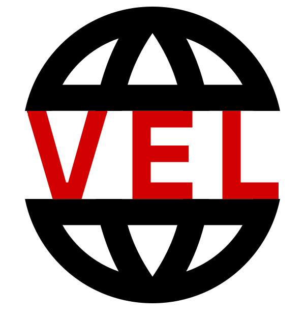

# VelNetUnity
Custom networking package for Unity

---

See [VelNetServer](https://github.com/velaboratory/VelNetServer) for description of the server.

By contrast to the server, the Unity side is pretty complex.

### NetworkManager
Deals with instantiating NetworkPlayers, and dealing with join, left, new master client events.  Also manages the list of NetworkObjects. It maintains a list of prefabs that can be instantiated, as well as the prefab to use for players.  

### NetworkPlayer
One of these will be instantiated for each player that joins the "room".  Most application communication happens by calling methods on this object.  Voice comms are also handled within this object.  Only one NetworkPlayer "isLocal".  The others are remote.  The local network player is the one that can modify it's "owned" network objects.    It also has a special networkobject representing itself (setup within the prefab, not part of the networkmanager list).  This is where most of the user behavior is going to go (e.g. an avatar). 

### NetworkObject
Something that can be owned by a network player, who is responsible for updating it.  Only the owner network player can/should modify a network object, whether locally or in response to a received message from the local version.  NetworkObjects are delineated by an session-unique id, which consists of the creator's userid + "-" + an increasing number designated by the creator.  Only local NetworkPlayers should send instantiate message, which contain this id.   This class should be extended to sync and send messages. Scenes are basically built from NetworkObjects.  Scene's can also start with network objects.  Those are known by all, and start with "-1-increasing".  That should happen the same on all clients, and is done locally at the start of the networkmanager.  An example of a NetworkObject is SyncTransform, which is a simple one that keeps an object's position and orientation synchronized.  

### Ownership
Ownership of objects changes regularly.  Any local networkplayer can send a message to take ownership of a networkid.  That client immediately assumes ownership.  The message is sent to the network, and will be ordered with any other ownership messages.  So, if two clients try to get ownership at the same time, both will assume ownership, but one will happen after the other.  This means that the one who was first will quickly lose ownership.

### Joining
An interesting problem is what to do when new clients join.  This is partially left up to the developer.  Any objects that are instantiated (or scene objects that are deleted) will be automatically handled. 

### Message Groups
Clients can manage network traffic using messaging groups.  This is especially useful for audio, where you can maintain a list of people close enough to you to hear audio  

